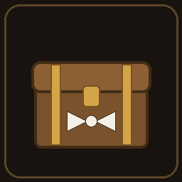

<!-- PROJECT SHIELDS -->
[![Contributors][contributors-shield]][contributors-url]
[![Forks][forks-shield]][forks-url]
[![Stargazers][stars-shield]][stars-url]
[![Issues][issues-shield]][issues-url]
[![MIT License][license-shield]][license-url]


<!-- PROJECT LOGO -->
<br />
<p align="center">
  <a href="https://github.com/EladKarni/ChestButler">
    
  </a>

  <h3 align="center">ChestButler</h3>

  <p align="center">
    A Valheim mod that sorts your storage for you. Dump everything into one chest and it gets distributed to the right chests around your base.
    <br />
    <br />
    <a href="https://github.com/EladKarni/ChestButler/issues">Report Bug</a>
    ·
    <a href="https://github.com/EladKarni/ChestButler/issues">Request Feature</a>
  </p>
</p>


<!-- TABLE OF CONTENTS -->
<details open="open">
  <summary><h2 style="display: inline-block">Table of Contents</h2></summary>
  <ol>
    <li><a href="#about-the-project">About The Project</a>
      <ul><li><a href="#built-with">Built With</a></li></ul>
    </li>
    <li><a href="#getting-started-players">Getting Started (Players)</a></li>
    <li><a href="#getting-started-developers">Getting Started (Developers)</a></li>
    <li><a href="#usage">Usage</a></li>
    <li><a href="#roadmap">Roadmap</a></li>
    <li><a href="#contributing">Contributing</a></li>
    <li><a href="#license">License</a></li>
    <li><a href="#contact">Contact</a></li>
    <li><a href="#acknowledgements">Acknowledgements</a></li>
  </ol>
</details>


<!-- ABOUT THE PROJECT -->
## About The Project

Storage in Valheim gets out of hand fast. You come back from a mining trip and spend five minutes walking between chests putting everything away.

This mod adds a "Sorter" toggle to chests. Anything you dump into a sorter chest gets moved to the right chest nearby when you close it. Stone goes where your stone already is, carrots end up in the kitchen, and anything the mod can't figure out just stays in the sorter so nothing is ever lost.

It works in the other direction too. You can pin a set of items to a chest and give it a Pull button that grabs those items from nearby storage. I use this for a cooking chest next to the cauldron that restocks itself on demand.

Since 1.1.0, a sorter chest can also **Organize** the whole base in one press: it previews how much would move, then consolidates every item type into its best chest, in place. Routing is station-aware — chests next to a forge attract metals and ores, the smelter chest gets ore and coal, the cauldron chest gets cooking ingredients — with the station map editable in config and modded stations supported via a log-assisted `CustomStations` entry.

Some notes on how it's built: every item transfer goes through MultiUserChest's networking, which means only the actual owner of a chest ever modifies it. This is the part most sorting mods get wrong, and it's why some of them eat items on multiplayer servers. Config lives on the server and syncs to everyone, so the whole group runs the same rules.

### Built With

* [BepInEx](https://github.com/BepInEx/BepInEx) and [HarmonyX](https://github.com/BepInEx/HarmonyX)
* [Jötunn](https://valheim-modding.github.io/Jotunn/)
* [MultiUserChest](https://github.com/MSchmoecker/No-Chest-Block)
* C# / .NET Framework 4.7.2


<!-- GETTING STARTED: PLAYERS -->
## Getting Started (Players)

### Prerequisites

* Valheim on Steam. The Xbox / Game Pass version can't run client mods.
* A mod manager. Grab r2modman from [valheim.thunderstore.io](https://valheim.thunderstore.io) via the "Get Manager" button.

### Installation

1. Search for ChestButler in the mod manager's Online tab and install it. The dependencies (BepInEx, Jötunn, MultiUserChest) come with it.
2. Launch the game with "Start modded".

Playing on our server? Import the ready-made profile instead: in the mod manager go to Import / Update, pick "Import new profile", choose "From code" and paste:

```
019f56be-5a3d-1f95-1b1e-9c8aa52a8a6b
```

That sets up the exact mods and versions the server runs.

If you prefer installing by hand, drop `ChestButler.dll` and the dependency DLLs into `BepInEx/plugins/`.

For multiplayer, the server and every player need the mod at the same version. Anyone missing it gets a message at connect telling them what to install. Crossplay has to be off since modded servers are Steam only. On a managed host like CubeCoders AMP, enable the BepInEx option in the instance config and upload `ChestButler.dll`, `Jotunn.dll` and `MultiUserChest.dll` to `BepInEx/plugins/`.


<!-- GETTING STARTED: DEVELOPERS -->
## Getting Started (Developers)

The project builds offline. There is no NuGet restore; every reference is a local DLL sitting in the repo.

### Prerequisites

* .NET SDK 8.0 or newer
* A Valheim install (you need its game assemblies to compile)

### Build setup

1. Clone the repo
   ```sh
   git clone https://github.com/EladKarni/ChestButler.git
   ```
2. Copy `valheim_Data/Managed/` from your game install into the repo root as `Managed/`. It stays untracked.
3. Put the four modding DLLs into `libs/`. See [`libs/README.md`](libs/README.md) for which files and where to find them.
4. Build:
   ```sh
   ./build.sh          # or: dotnet build src/ChestButler/ChestButler.csproj -c Release
   ```
   The DLL ends up in `dist/`. Framework references resolve out of `Managed/` through `FrameworkPathOverride`, and `NuGet.config` has no package sources on purpose.

### Architecture map

| Area | Files |
|---|---|
| Plugin entry, config | `src/ChestButler/Plugin.cs` |
| Sorting engine (owner-gated tick) | `Core/SorterBehaviour.cs` |
| Routing rules | `Core/Router.cs` |
| Per-chest filters (ZDO pins) | `Core/Filters.cs`, `Core/SorterZdo.cs` |
| Pull/restock | `Core/Puller.cs` |
| Organize planner (pure, deterministic, no Unity deps) | `Core/OrganizePlanner.cs` |
| Organize Unity adapter + batched execution | `Core/Organizer.cs` |
| Station / smelter / fermenter detection | `Core/Stations.cs`, `Patches/ProcessorPatches.cs` |
| Item groups | `Core/Groups.cs`, `Core/Names.cs` |
| Chest UI toolbar | `Patches/GuiPatch.cs` |
| Planner unit tests (run offline, no game needed) | `tests/OrganizePlannerTests/` — `dotnet run` |

One rule matters more than any other in this codebase: never write to an inventory you don't own. All chest-to-chest moves go through MultiUserChest's request/response API, which routes the change to whichever peer owns the target chest. Writing straight into a remote chest's `Inventory` is exactly how the old Smarter Containers mod ended up deleting items, so PRs that bypass this will be rejected.


<!-- USAGE -->
## Usage

Buttons show up at the bottom of every chest UI:

| Button | Shown on | Does |
|---|---|---|
| `Sorter: ON/OFF` | any chest | marks it as a dump chest, contents distribute when closed |
| `Organize`, then `Confirm?` | sorter chests | previews a base-wide consolidation, second press within 5 s executes it |
| `Pin`, then `Auto (n)`/`Manual (n)` | normal chests | saves the current contents as filters, then toggles whether the sorter fills it automatically |
| `Clear` | chests with filters | wipes the saved filters |
| `Pull` | chests with filters | grabs one stack of each saved item from nearby chests |

Routing picks a target in this order: a chest that names the item, then a chest whose group covers it, then any chest that already holds some. Ties go to higher priority, then to whichever chest holds the most of that item, then to the nearest one. If the best chest only has room for part of a stack it gets topped off and the rest re-routes. Organize uses the same ranking plus a station-adjacency tier (after pins/groups, before most-held), decides one winning chest per item type, and is capacity-exact so its preview never overpromises.

Config is in `BepInEx/config/eksolutions.chestbutler.cfg`: sorting radius (32 m default, shared with Organize), tick rate, stacks per tick, the contains fallback, the `[Stations]` map (+ `CustomStations` for modded ones), Organize's `MovesPerTick`/`StationRange`, and all the item groups under `[ItemGroups]`. The server's values win and sync to clients.


<!-- ROADMAP -->
## Roadmap

* [ ] Transfer VFX/SFX on chests
* [ ] Gamepad support for the chest UI toolbar
* [ ] Filter editor panel (view and remove individual pinned items, group checkboxes)
* [ ] Craftable dedicated Sorter Chest piece
* [ ] Localization
* [ ] Valheim 1.0 ("Deep North", Sept 2026) compatibility pass

See the [open issues](https://github.com/EladKarni/ChestButler/issues) for the full list.


<!-- CONTRIBUTING -->
## Contributing

Contributions are what make the open source community such an amazing place to learn, inspire, and create. Any contributions you make are **greatly appreciated**.

1. Fork the Project
2. Create your Feature Branch (`git checkout -b feature/AmazingFeature`)
3. Commit your Changes (`git commit -m 'Add some AmazingFeature'`)
4. Push to the Branch (`git push origin feature/AmazingFeature`)
5. Open a Pull Request against `dev`

Branches: `dev` is where work happens, `staging` is what our group playtests, `prod` is what the live server runs, and `main` tracks the latest published release.

A few ground rules: don't commit game assemblies (`Managed/`) or third-party DLLs (`libs/`), keep the ownership rule described above intact, and test anything multiplayer-sensitive with two clients before opening the PR.


<!-- LICENSE -->
## License

Distributed under the MIT License. See `LICENSE` for more information.


<!-- ACKNOWLEDGEMENTS -->
## Acknowledgements

* [MultiUserChest](https://github.com/MSchmoecker/No-Chest-Block) and [ItemHopper](https://github.com/MSchmoecker/ValheimHopper) by MSchmoecker. The networking approach here is built on MUC, and ItemHopper's source was the reference for doing chest transfers safely.
* [Jötunn](https://valheim-modding.github.io/Jotunn/) for mod compatibility checks and synced config.
* Smarter Containers by Flueno, which had the right idea years ago. This is a from-scratch rebuild of that concept with a transfer engine that doesn't lose items.
* [Best-README-Template](https://github.com/EladKarni/Best-README-Template)


<!-- MARKDOWN LINKS & IMAGES -->
[contributors-shield]: https://img.shields.io/github/contributors/EladKarni/ChestButler.svg?style=for-the-badge
[contributors-url]: https://github.com/EladKarni/ChestButler/graphs/contributors
[forks-shield]: https://img.shields.io/github/forks/EladKarni/ChestButler.svg?style=for-the-badge
[forks-url]: https://github.com/EladKarni/ChestButler/network/members
[stars-shield]: https://img.shields.io/github/stars/EladKarni/ChestButler.svg?style=for-the-badge
[stars-url]: https://github.com/EladKarni/ChestButler/stargazers
[issues-shield]: https://img.shields.io/github/issues/EladKarni/ChestButler.svg?style=for-the-badge
[issues-url]: https://github.com/EladKarni/ChestButler/issues
[license-shield]: https://img.shields.io/github/license/EladKarni/ChestButler.svg?style=for-the-badge
[license-url]: https://github.com/EladKarni/ChestButler/blob/main/LICENSE
